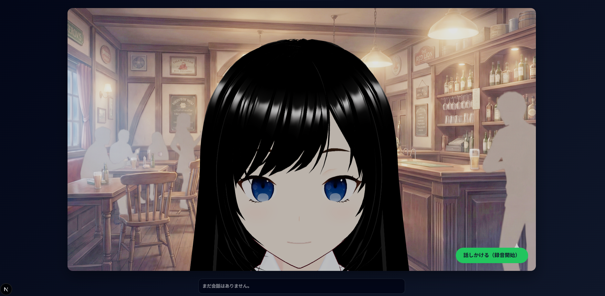

# VRM Chat App

## 本アプリの概要
生成AIサービスを用いてVRMモデルと音声対話ができるシンプルなチャットアプリです。背景やキャラクターを切り替えながら、用途に合わせた体験を作れます。

### 活用シチュエーションの一例
- 日常的な会話を楽しむ話し相手として
- 英会話のトレーナーとして
- アイデアをディスカッションする相手として



## 本アプリをセットアップして利用する流れ

### 前提

- Node.js と npm がインストール済み

### セットアップ手順
このアプリを `git clone` して使い始めるための手順をまとめます。

1. リポジトリを取得して移動

```bash
git clone https://github.com/Takashi-Iskw/vrm-chat-app.git
cd vrm-chat-app
```

2. 依存関係をインストール

```bash
npm install
```

3. 環境変数ファイルを作成して編集

```bash
cp .env.example .env.local
```

`.env.local` を開き、以下を必要に応じて書き換えます。

- `OPENAI_API_KEY`  
  自分の OpenAI API キーを設定してください。
- `NEXT_PUBLIC_OPENAI_TTS_VOICE`  
  OPENAI APIの音声の種類を指定します（例: `sage`）。
- `NEXT_PUBLIC_BG_IMAGE`  
  背景画像ファイル名を指定します（例: `bar.png`）。
- `NEXT_PUBLIC_VRM_MODEL`  
  利用するVRMモデルのパスを指定します（例: `/vrm/test1.vrm`）。
- `OPENAI_SYSTEM_PROMPT`  
  システムプロンプトを用途に合わせて調整します。

4. アプリを起動

```bash
npm run dev
```

ブラウザで `http://localhost:3000` を開くとアプリが起動します。

## 活用のヒント
セットアップ後は、`.env.local` にてVRMモデル、音声、背景画像などを変更することで、お好みの使い方に調整できます。

- VRMモデルは`public/vrm`以下に配置します
- OPENAIのAPIの音声モデルは[こちら](https://developers.openai.com/api/docs/guides/text-to-speech/)から確認できます
- 背景画像は`public/bg`以下に配置します


また、アプリ画面上部の「System Prompt」を切り替えることで、予め用意されたプロンプトでアプリを簡易に利用することもできます。


### VRMモデルの用意に関して
VRMモデルの作成には[こちら](https://vroid.com/studio)のサイトなどが利用できます。

